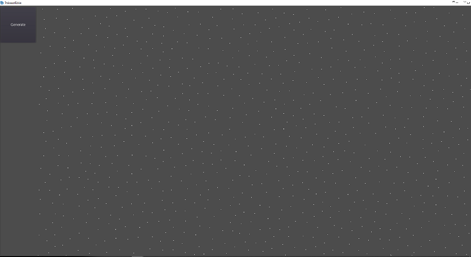

# Godot_PoissonDiskSampling

 A GDscript to create poisson disk sampling, the script return a Vector2D array. You can specify the number of point (with an error of +- 2-3%) or only the min distance between points.
 
 
# Usage
 
 Create new node and add PoissonDisk.gd 

# Example

 Open View.tscn and run the scene  
 
 
